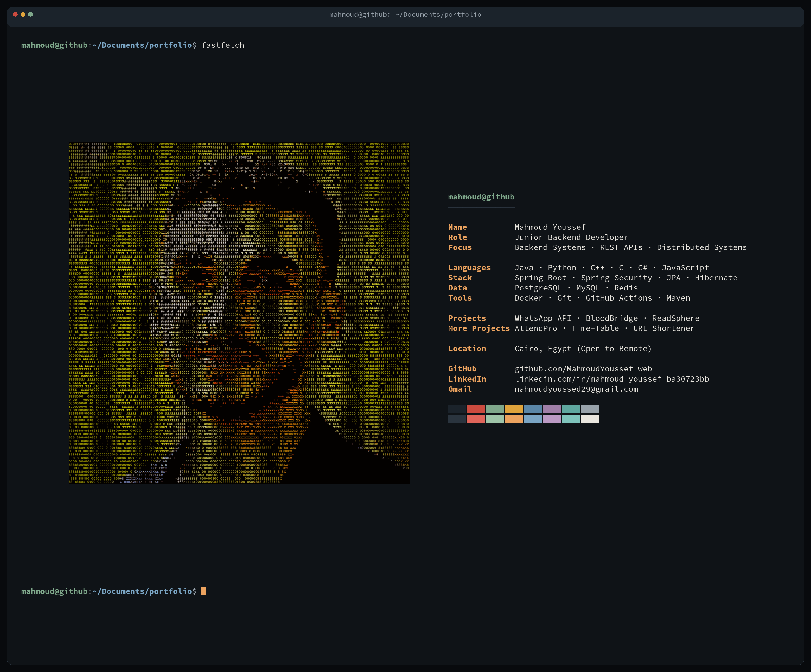
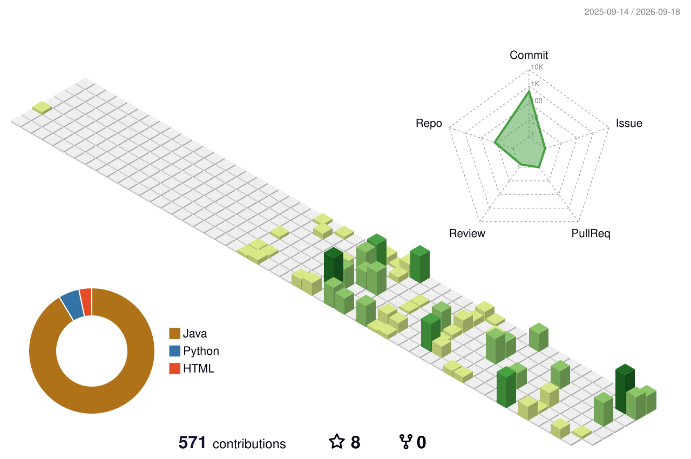

### Backend Engineer — Java 21 · Spring Boot 3

I build reliable backend systems with a focus on **concurrency control**, **transactional consistency**, **distributed architecture**, and **secure API design**.

---

### 🛠️ Tech Stack

| | |
|---|---|
| **Backend** | Java 21 · Spring Boot 3 · Spring Security |
| **Data** | PostgreSQL · MySQL · Spring Data JPA · Hibernate · Raw JDBC |
| **Caching** | Redis (Cache-Aside · Rate Limiting · Atomic ID Generation) |
| **Payments** | Stripe Checkout · Webhook Ingestion (HMAC-verified) |
| **Infrastructure** | Docker · Docker Compose · GitHub Actions CI/CD |
| **Testing & Docs** | JUnit 5 · Mockito · Testcontainers · SpringDoc OpenAPI |
| **Auth & Identity** | Keycloak · JWT · RBAC · Token Rotation |
| **Migrations** | Flyway |

---

### 🎯 Expertise

- Distributed Systems
- Concurrency Control (Pessimistic / Optimistic Locking)
- Transactional Consistency & Idempotency
- Authentication & Authorization (JWT, RBAC, Token Rotation)
- Event-Driven Architecture
- Caching & Rate Limiting
- Payment Integration
- API Design

---

### 📐 Engineering Principles

- Design for correctness before optimization.
- Keep business logic independent from infrastructure.
- Prefer explicit consistency over hidden side effects.
- Build systems that remain predictable under concurrent workloads.

---

### 🚀 Featured Projects

| Project | What it does | Stack |
|---|---|---|
| **[BloodBridge](https://github.com/MahmoudYoussef-web/bloodbridge-api)** | Blood donation matching platform with governorate-based fallback matching, JWT security hardening, outbox pattern, and QR-based verification flows. | Spring Boot · PostgreSQL · Redis · Keycloak |
| **[WhatsApp Clone API](https://github.com/MahmoudYoussef-web/whatsapp-clone-realtime-api)** | Real-time messaging API with WebSocket/STOMP, presence tracking, and media handling. | Spring Boot · WebSocket/STOMP · Keycloak · MinIO · Redis |
| **[CalCounter](https://github.com/MahmoudYoussef-web/calorie-tracker-backend)** | AI-powered nutrition tracking — photograph a meal and the AI identifies the food and calculates calories automatically. | Spring Boot · MySQL · JWT · HuggingFace |
| **[AttendPro](https://github.com/MahmoudYoussef-web/attendance-management-api)** | Attendance management system. | Spring Boot · PostgreSQL |
| **[Time-Table](https://github.com/MahmoudYoussef-web/Time-Table)** | University timetable generator producing PNG, PDF, and Excel outputs. | Spring Boot · Apache Batik · Flying Saucer |
| **[URL Shortener](https://github.com/MahmoudYoussef-web/url-shortener-system)** | Lightweight URL shortening service. | Spring Boot · Redis |

---

### 📊 Contribution Graph 3D

<picture>
  <source media="(prefers-color-scheme: dark)" srcset="profile-3d-contrib/profile-night-green.svg">
  
</picture>

---

### 🤝 Let's connect

📫 Open to remote opportunities

